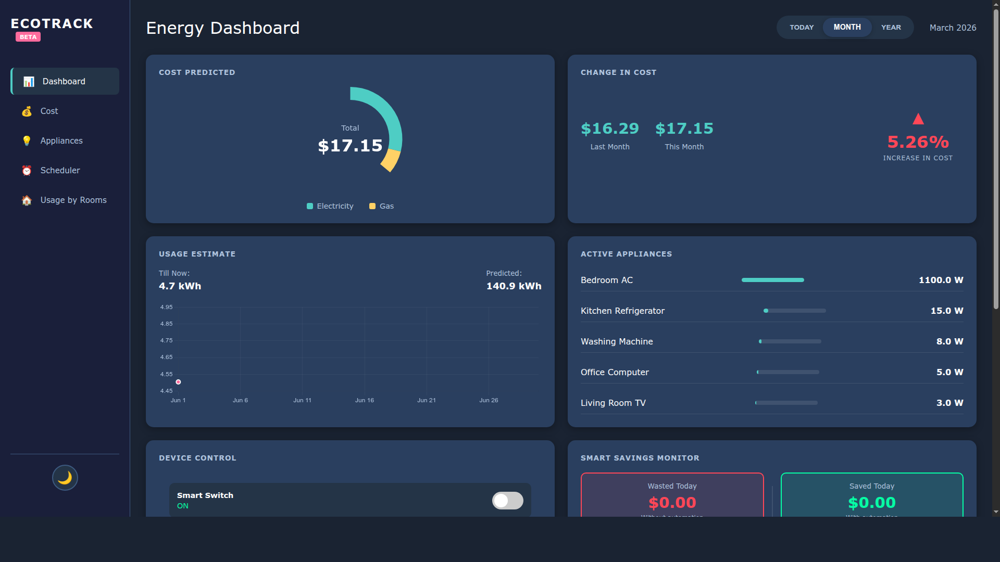
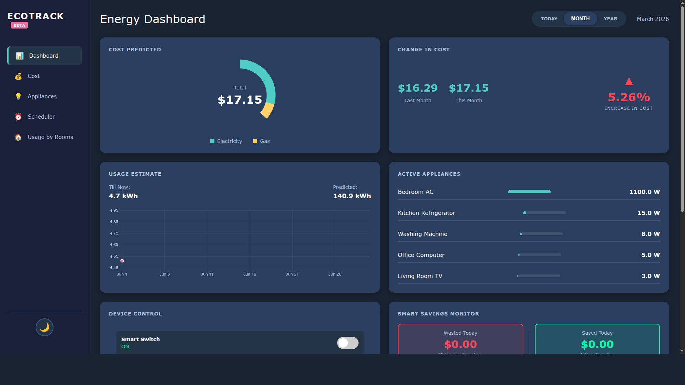
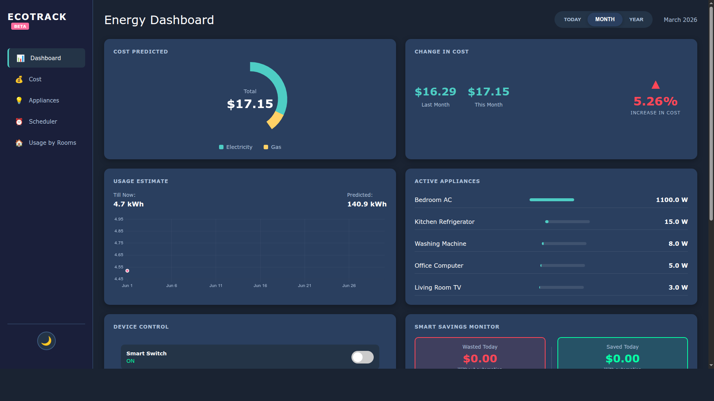
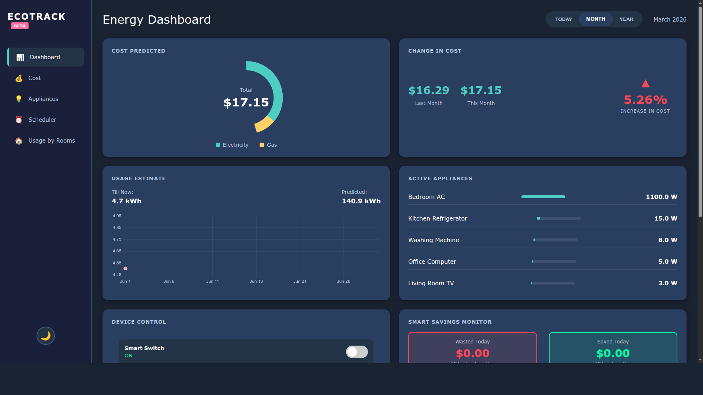
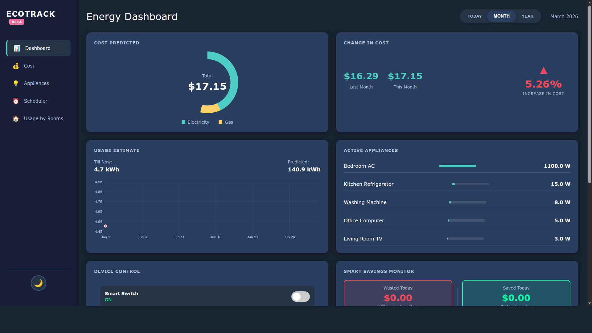

# EcoTrack - Smart Energy Monitoring System

<p align="center">
  
  
  
  
</p>

## Overview

**EcoTrack** is a comprehensive smart energy monitoring system designed to help users track, analyze, and optimize their electricity consumption. The system integrates with **Tuya smart plugs** to provide real-time monitoring of appliances, automatic sleep mode detection, and intelligent cost savings tracking.

---

## Features

### 1. Real-Time Energy Monitoring
- Track power consumption in watts
- Monitor voltage levels
- Detect device modes (Active/Standby/Sleep)
- Support for multiple devices

### 2. Smart Savings Analysis
- Calculate wasted energy costs
- Track savings from automation
- Device-level efficiency scoring
- Net savings calculation

### 3. Device Control
- Toggle devices on/off remotely via Tuya Cloud
- Manual override support
- Auto-control tracking

### 4. Usage Analytics
- Cost analysis by period (Today/Month/Year)
- Usage by room visualization
- Device comparison charts
- Historical data tracking

### 5. Scheduler
- Create device schedules
- Set start/end times
- Configure repeat patterns (Daily/Weekly/Monthly)
- Enable/disable schedules

---

## Tech Stack

| Layer | Technology |
|-------|------------|
| **Backend** | Python 3.12, Flask 3.0 |
| **Database** | SQLite (built-in) |
| **Frontend** | HTML5, CSS3, JavaScript (ES6+) |
| **Charts** | Chart.js 4.4.0 |
| **IoT Integration** | Tuya Cloud API |

---

## Project Structure

```
EcoTrack/
├── backend/
│   ├── app.py              # Main Flask application
│   ├── ecotrack.db        # SQLite database
│   └── venv/              # Python virtual environment
├── frontend/
│   ├── index.html         # Main dashboard
│   ├── style.css         # Styling
│   ├── script.js         # Frontend logic
│   └── venv/             # Python virtual environment
├── screenshots/          # App screenshots
├── requirements.txt      # Python dependencies
└── README.md            # This file
```

---

## Getting Started

### Prerequisites

- Python 3.8 or higher
- Modern web browser (Chrome, Firefox, Safari, Edge)
- Tuya Smart Plugs (optional for device control)

### Installation

1. **Clone the repository**
   ```bash
   git clone https://github.com/Anshgrag/EcoTrack.git
   cd EcoTrack
   ```

2. **Install backend dependencies**
   ```bash
   cd backend
   pip install -r requirements.txt
   ```

3. **Start the backend server**
   ```bash
   python app.py
   ```
   The API will run at `http://localhost:5000`

4. **Start the frontend server**
   ```bash
   cd frontend
   python -m http.server 8000
   ```
   Open `http://localhost:8000` in your browser

---

## Screenshots

### Dashboard


### Cost Analysis


### Appliances


### Scheduler


### Usage by Rooms


---

## API Endpoints

| Endpoint | Method | Description |
|----------|--------|-------------|
| `/` | GET | API health check |
| `/api/electricity/add` | POST | Add electricity reading |
| `/api/electricity/history` | GET | Get electricity history |
| `/api/savings` | GET | Get savings data |
| `/api/devices` | GET | List all devices |
| `/api/devices/<id>/toggle` | POST | Toggle device |
| `/api/device-profile` | POST | Add device profile |
| `/api/rooms/usage` | GET | Get room usage |
| `/api/device-event` | POST | Record device event |

---

## Demo Data

The system comes with pre-configured demo devices:
- **Living Room TV** (120W rated)
- **Kitchen Refrigerator** (150W rated)
- **Bedroom AC** (1200W rated)
- **Office Computer** (200W rated)
- **Washing Machine** (500W rated)

---

## Configuration

### Tuya Integration

To enable device control, configure `tinytuya.json` in the project root:

```json
{
  "apiKey": "your_api_key",
  "apiSecret": "your_api_secret",
  "apiRegion": "us",
  "apiDeviceID": "your_device_id"
}
```

### Cost Settings

Default electricity cost is set to **$0.12/kWh** (configurable in `backend/app.py`)

---

## Future Enhancements

- [ ] Mobile app (React Native)
- [ ] Push notifications
- [ ] AI-based consumption predictions
- [ ] Multi-user support
- [ ] Export reports (PDF/Excel)
- [ ] Integration with more smart home platforms

---

## License

This project is licensed under the MIT License.

---

## Author

**Ansh Raghav**
- GitHub: [@Anshgrag](https://github.com/Anshgrag)

---

<p align="center">
  Made with ❤️ for a greener future
</p>
